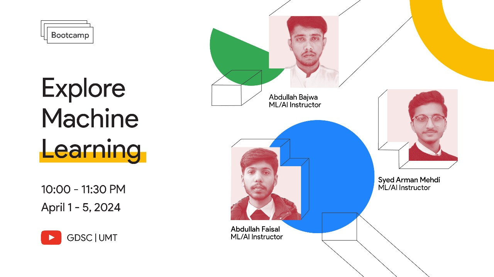

GDSC UMT organized a 5 days virtual "Explore Machine Learning" bootcamp that spanned from april 1-5, 2024. My job was to cover Classification on Day 3 and 4.
This Repo contains all the codes, datasets and references shared in those 2 days.
- Jupyter Notebooks and Datasets are in folders named as "Day _X_"
- PDF with reference material is uploaded here as well
- Day 3 [[Youtube](https://youtu.be/ETJ88o8cl2Y?si=DV3DpFUSlJjgkeVP)]
- Day 4 [[Youtube](https://youtu.be/8qbzrgXUbJ0?si=kCF6AGelMu8Xhc9J)]
- Whole Playlist [[Youtube](https://youtube.com/playlist?list=PL51tcFoTrewma4Pry746uwdoavSeSiCaB&si=_1rRpl3dFa6aC-HK)]
- Practice Datasets can be found here [[GitHub](https://github.com/Geeky-Hassan/5-Days-ML-Bootcamp_projects/)]

